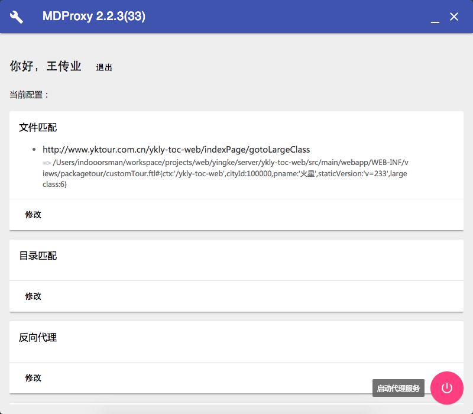
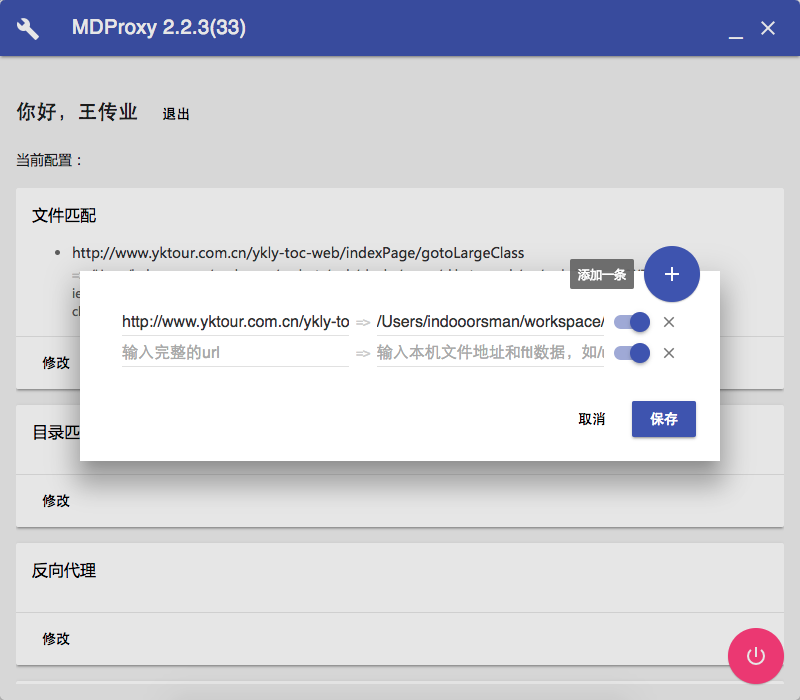
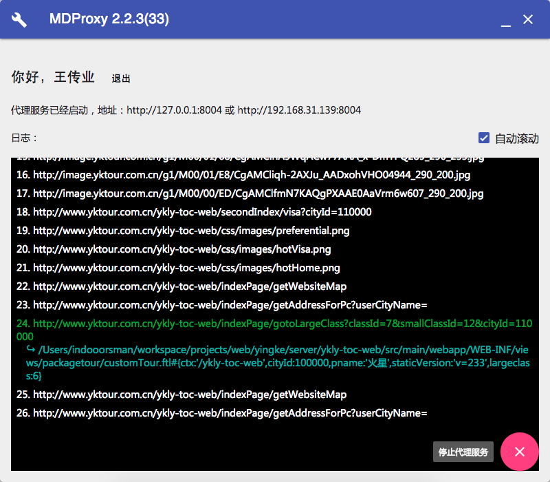

# 跨平台的前端开发代理工具

## 概览

采用[NW.js](http://nwjs.io)+[Vue.js](http://vuejs.org)+[Material Design lite](https://getmdl.io/)开发，功能：
- 跨平台桌面客户端（Windows 64位/Linux 64位/Mac OS）(TODO: 打包Linux版本)
- 指定文件和目录代理
- 反向代理
- 缓存请求 (TODO: 此功能尚未完成)
- 配置代理服务端口
- 自身的自动更新

## 屏幕截图







## 下载（TODO 补充下载链接）

- Windows 64位：[mdproxy.win64.zip](#nogo)
- Linux 64位：[mdproxy.linux64.zip](#nogo)
- Mac OS：[mdproxy.mac.zip](#nogo)

## 安装（TODO 依赖上一步的下载）

1. 下载对应平台的压缩包
1. 解压到任意目录
1. 运行
    - Mac OS: 运行`mdproxy.app` TODO 说明新版Mac OS需要做的额外操作`sudo find . -iname '*.app' -print0 | xargs -0 xattr -d com.apple.quarantine`
    - Windows: 运行`mdproxy.exe`
    - Linux：（TODO）

## 使用

    //TODO
    
## 开发
    
1. 下载对应平台的 [NW.js SDK](https://nwjs.io/downloads/)

1. 克隆源码，安装依赖：

   ```bash
   git clone https://github.com/indooorsman/MDProxy.git
   cd MDProxy
   npm install
   ```

1. 启动：

   ```bash
   npm start
   # 之后请按提示输入你下载并解压后的NW.js SDK目录中nwjs可执行文件的绝对路径
   ```

1. 如何调试请参考NW.js相关文档：<http://docs.nwjs.io/en/latest/For%20Users/Debugging%20with%20DevTools/>   

## Chrome插件

配合SwitchyOmega使用，可以方便切换环境

[下载SwitchyOmega](https://github.com/FelisCatus/SwitchyOmega/releases)
